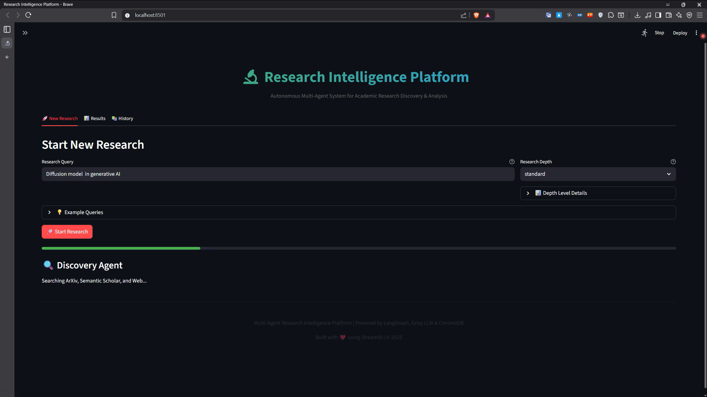
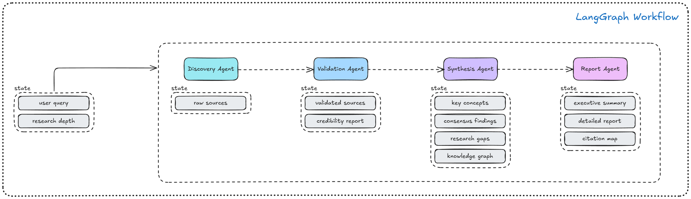

# Multi-Agent Research Intelligence Platform

> An advanced multi-agent research system that automates the complete research workflow: **discovery → validation → synthesis → reporting** for academic and technical inquiries. The platform generates verifiable, structured reports with knowledge graphs.

---

## Overview

The Multi-Agent Research Intelligence Platform is a sophisticated system designed to streamline the research process by automating key stages of information discovery and analysis. Built with modern AI technologies, it enables users to conduct comprehensive research efficiently, ensuring source quality and generating structured, verifiable reports with knowledge graphs. 


## Demo
- Click to watch demo

[](static/demo.mp4)

## Key Features

- **Automated Research Workflow**: Complete automation of discovery, validation, synthesis, and reporting
- **Specialized AI Agents**: Each agent handles a distinct phase of the research process
- **Multi-Source Integration**: Aggregates information from ArXiv, Semantic Scholar, and web sources
- **Source Validation**: Credibility scoring and validation of research sources
- **Knowledge Graphs**: Visual representation of relationships between concepts and findings
- **Structured Reporting**: Comprehensive reports with executive summaries and detailed analysis
- **Research Gap Identification**: Automatic detection of areas needing further investigation
- **Secure Architecture**: Designed with privacy and API security in mind

## Tech Stack


- **Language**: Python 3.8+
- **LLM Orchestration**: LangGraph for agent coordination
- **AI Models**: GROQ API (LLaMA 3, Mixtral, etc.)
- **Search APIs**: Tavily Search, ArXiv API, Semantic Scholar API
- **Visualization**: NetworkX and Matplotlib for knowledge graph visualization


## System Architecture



### Agent Responsibilities

| Agent | Primary Role | Input | Output |
| --- | --- | --- | --- |
| Discovery Agent | Gathers resources from ArXiv, Semantic Scholar, Tavily | Research query, depth | Raw resource list |
| Validation Agent | Evaluates credibility, filters noise | Raw resources | Scored and validated sources |
| Synthesis Agent | Integrates and analyzes insights | Context and metadata | Analysis draft with knowledge graph |
| Reporter Agent | Generates standardized reports | Analysis draft | `.txt` reports and knowledge graph visualizations |

### Technical Specifications

- **LLM Integration**: GROQ API for fast inference (LLaMA 3, Mixtral, etc.)
- **Orchestration**: LangGraph for agent state management
- **Search Sources**: ArXiv API, Tavily Search API, Semantic Scholar API
- **Visualization**: Knowledge graph visualization with NetworkX and Matplotlib
- **API Rate Limits**: Configurable delays to respect source APIs
- **Concurrent Processing**: Thread-safe design for multiple concurrent queries

### Performance Characteristics

- **Quick Research**: ~3-5 minutes, 3-5 sources, basic validation
- **Standard Research**: ~8-10 minutes, 8-10 sources, comprehensive validation
- **Deep Research**: ~12-15 minutes, up to 15 sources, strict validation + cross-referencing

## Quick Start

### Prerequisites
- Python ≥ 3.8
- GROQ API key (required)
- Tavily API key (recommended for web search)

### Installation
```bash
git clone <repository-url>
cd multi-agent-research
python -m venv .venv
source .venv/bin/activate   # Windows: .venv\Scripts\activate
pip install -r requirements.txt
streamlit run src/app.py
```

### Environment Configuration
Create a `.env` file in the root directory:
```env
GROQ_API_KEY=your_groq_api_key_here
TAVILY_KEY=your_tavily_api_key_here  # Optional
LOG_LEVEL=INFO
```

### Usage Examples

#### CLI Interface
```bash
python main.py
```
Interactive flow:
1. Enter research question (e.g., *"Impact of GPT-5 models on edge AI?"*).
2. Select `research_depth`: `quick` (~5 minutes), `standard`, or `deep`.
3. Monitor progress in terminal or log files.

#### Library Integration
```python
from src.agentic_ai_pipeline import run_research_pipeline

state = run_research_pipeline(
    query="Future of hybrid quantum models",
    research_depth="standard"
)
print(state.report_path)
```

#### Advanced Configuration
```python
from src.agentic_ai_pipeline import run_research_pipeline
from src.config import Config

# Customize configuration
config = Config(
    groq_api_key="your_api_key",
    max_sources=15,
    credibility_threshold=0.7,
    research_depth="deep"
)

state = run_research_pipeline(
    query="Impact of quantum computing on cryptography",
    config=config
)
```

## Output Artifacts

- Final reports: `reports/report_<timestamp>.txt`
- Knowledge graphs: `visualisations/kg_<timestamp>.png`
- Pipeline logs: `logs/research_pipeline.log`
- Execution history: `data/history.json`

Each report contains:
1. Executive summary
2. Context and terminology section
3. Detailed analysis (with source references and citations)
4. Research gaps and next steps recommendations


